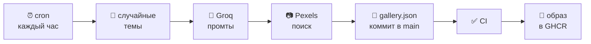

<div align="center">

# test-ci-cd

**Галерея, которая обновляет себя сама.**

LLM придумывает поисковые запросы, фотобанк находит по ним снимки,
GitHub Actions коммитит результат и пересобирает образ — раз в час, без участия человека.

[](https://github.com/mujammed-04/test-ci-cd/actions/workflows/ci.yml)
[](https://github.com/mujammed-04/test-ci-cd/actions/workflows/gallery.yml)
[](https://github.com/mujammed-04/test-ci-cd/actions/workflows/release.yml)


</div>

---

## Как это работает



| Шаг | Что происходит |
|:--:|---|
| **1** | Из списка тем случайно выбирается несколько штук |
| **2** | **Groq** превращает их в короткие поисковые промты |
| **3** | **Pexels** находит снимок под каждый промт |
| **4** | Результат коммитится в `main`, образ пересобирается |

> [!NOTE]
> Случайность вносится **до** обращения к модели. Если просто просить LLM
> «придумай запросы для фото», она сходится к одним и тем же сюжетам —
> закаты, кофе, ноутбуки. Температура помогает слабо.

<details>
<summary><b>Почему CI вызывается вручную, а не по push</b></summary>

<br>

Коммит, сделанный с `GITHUB_TOKEN`, **не запускает** `push`-workflow —
GitHub блокирует это, чтобы workflow не триггерили друг друга по кругу.

Поэтому `ci.yml` и `release.yml` объявляют `workflow_call`, а `gallery.yml`
вызывает их напрямую:

```yaml
verify:
  needs: refresh
  if: needs.refresh.outputs.changed == 'true'
  uses: ./.github/workflows/ci.yml
```

Условие `if` важно: если фото не изменились, сборка не запускается
и минуты Actions не тратятся впустую.

</details>

<details>
<summary><b>Почему Pexels, а не Unsplash</b></summary>

<br>

Проект начинался на Unsplash, но там Demo-доступ ограничен **50 запросами
в час**, а Production требует заявки с задеплоенным продуктом и
проверкой атрибуции.

У Pexels — **200 запросов в час** и 20 000 в месяц сразу после регистрации,
без модерации.

Расход на прогон: 1 запрос к Groq + 6 к Pexels — около 3% часового лимита.

</details>

---

## Быстрый старт

```bash
yarn install
cp .env.example .env      # вписать ключи
yarn dev
```

Галерея — на `/ru/gallery` (а также `/en`, `/kk`).

### Ключи

| Переменная | Где взять | Обязательна |
|---|---|:--:|
| `GROQ_API_KEY` | [console.groq.com/keys](https://console.groq.com/keys) | да |
| `PEXELS_API_KEY` | [pexels.com/api/new](https://www.pexels.com/api/new/) | да |
| `PHOTO_COUNT` | 1–20, по умолчанию `6` | нет |

Те же имена нужны в **Settings → Secrets and variables → Actions**.

> [!IMPORTANT]
> Скрипт не читает `.env` сам — Node не подхватывает такие файлы
> автоматически. Для ручного прогона нужен флаг `--env-file`:
>
> ```bash
> PHOTO_COUNT=3 node --env-file=.env scripts/generate-gallery.mjs
> ```

---

## Структура

```
scripts/
  generate-gallery.mjs        генерация: Groq → Pexels → JSON
src/
  app/[locale]/
    gallery/page.tsx          сетка фотографий
    gallery/[id]/page.tsx     размер, средний цвет, автор
  data/
    gallery.json              ← пишется workflow'ом
    gallery.ts                типы и лукап по id
  i18n/                       next-intl: en, ru, kk
.github/workflows/
  gallery.yml                 cron + генерация + вызов CI
  ci.yml                      lint, typecheck, build, commitlint
  release.yml                 сборка образа в GHCR
```

### Страницы

| Маршрут | Что показывает |
|---|---|
| `/[locale]/gallery` | сетка фотографий, ведёт на детальные |
| `/[locale]/gallery/[id]` | снимок, размер, средний цвет, автор |

Обе статические — генерируются из `gallery.json` на этапе сборки.
Поэтому новые фото появляются на сайте только после пересборки,
чем и занимается шаг 4.

---

## Команды

| Команда | Что делает |
|---|---|
| `yarn dev` | дев-сервер |
| `yarn build` | продакшн-сборка |
| `yarn typecheck` | `next typegen` + `tsc --noEmit` |
| `yarn lint` | ESLint |

---

## Стек

**Next.js 16** (App Router, `output: standalone`) · **React 19** ·
**TypeScript 5** · **Tailwind CSS 4** · **next-intl** ·
**Node 22** · **Docker** → GHCR

Коммиты — [Conventional Commits](https://www.conventionalcommits.org/),
проверяются commitlint'ом в pre-commit хуке и в CI.

---

> [!WARNING]
> **Атрибуция обязательна.** Условия Pexels требуют видимой подписи
> со ссылкой на автора снимка. Она отрисована на обеих страницах
> галереи — не убирайте её из `gallery/page.tsx`
> и `gallery/[id]/page.tsx`.

<div align="center">
<br>
<sub>Фотографии — <a href="https://www.pexels.com">Pexels</a> · промты — <a href="https://groq.com">Groq</a></sub>
</div>
